# 🛡️ Awesome Cloud Security Posture Management (CSPM)

<p align="center">
  
</p>

<p align="center">
  <a href="https://github.com/ishandutta2007/Awesome-Awesome-Awesome"></a><a href="https://discord.gg/jc4xtF58Ve"></a>
  <a href="https://github.com/ishandutta2007/Awesome-Cloud-Security-Posture-Management/stargazers"></a>
  <a href="https://github.com/ishandutta2007/Awesome-Cloud-Security-Posture-Management/network/members"></a>
  <a href="https://github.com/ishandutta2007/Awesome-Cloud-Security-Posture-Management/issues"></a>
  <a href="https://github.com/ishandutta2007/Awesome-Cloud-Security-Posture-Management/blob/main/LICENSE"></a>
  <a href="https://github.com/ishandutta2007"></a>
</p>

---

## 📌 Executive Summary & Market Landscape

> **Market Analysis & Dynamics** 📊  
> The global **Cloud Security Posture Management (CSPM)** and **CNAPP** market is estimated at **~$9.2 Billion (2026)** and is projected to reach over **$19 Billion by 2030** (CAGR ~19.5%).  
> 
> **Market Fragmentation**: The market is **moderately fragmented**, undergoing rapid consolidation. Hyper-scaler suite dominance (Microsoft Defender, Palo Alto Prisma Cloud) and category leaders (Wiz, Orca, CrowdStrike) compete directly alongside a vibrant ecosystem of specialized open-source security projects (Prowler, Trivy, Cloud Custodian).

---

## 🔍 Overview

A curated directory of top **Cloud Security Posture Management (CSPM)** platforms, **CNAPP** solutions, and **Open-Source Auditing Tools**. Designed for cloud security engineers, DevSecOps practitioners, platform architects, and security auditors.

Focus areas include:
* ☁️ **Cloud Misconfiguration & Vulnerability Scanning** (AWS, Azure, GCP, OCI, Alibaba Cloud)
* 📜 **Compliance Benchmarking & Governance** (CIS Benchmarks, NIST SP 800-53, SOC 2, ISO 27001, HIPAA, PCI-DSS)
* 🕸️ **Attack Path Analysis & Security Graph Visualization**
* 📦 **Infrastructure as Code (IaC) & Container Posture** (Terraform, CloudFormation, Kubernetes, Helm)
* 🔐 **Cloud Infrastructure Entitlement Management (CIEM) & Least Privilege**

---

## 📋 Table of Contents

- [🏢 SaaS & Commercial CSPM Platforms](#-saas--commercial-cspm-platforms)
- [🔓 Open-Source GitHub Projects](#-open-source-github-projects)
- [🤝 How to Contribute](#-how-to-contribute)
- [☕ Support & Sponsorship](#-support--sponsorship)
- [⚠️ Disclaimer](#%EF%B8%8F-disclaimer)
- [📈 Star History](#-star-history)

---

## 🏢 SaaS & Commercial CSPM Platforms

The commercial market offers agentless SideScanning, deep Security Graph attack-path telemetry, enterprise compliance frameworks, and managed SLAs. 

| Platform | Market Size / Valuation / Revenue | Starting Price | Free Tier / Trial Limits | Key Features & Focus |
| :--- | :--- | :--- | :--- | :--- |
| **[Microsoft Defender for Cloud](https://azure.microsoft.com/products/defender-for-cloud)** | **~$3 Trillion Market Cap** (Microsoft Security ~$20B+ revenue) | **$0.002 / resource / hour** (~$1.46/resource/mo for CSPM plan) | **Foundational CSPM Free forever**; 30-day free trial for Defender CSPM plan | Native multi-cloud CSPM across Azure, AWS, & GCP with DevOps security and attack path analysis. |
| **[Wiz](https://www.wiz.io/)** | **$32 Billion Valuation** (Acquired by Google in 2026; $1B+ ARR) | **~$24,000 / year** (~$2,000/mo minimum marketplace tier) | **Guided 14-day enterprise PoC / Free Trial** with cloud connector assessment | Market leader in agentless CNAPP/CSPM, Security Graph attack-path analysis, and agentless inventory. |
| **[Palo Alto Prisma Cloud](https://www.paloaltonetworks.com/prisma/cloud)** | **~$110 Billion Market Cap** (Palo Alto Networks) | **~$90 / credit / year** (~$15,000/yr enterprise base minimum) | **30-day free trial** (up to 100 workloads or cloud accounts) | Code-to-Cloud security platform with deep IaC, CSPM, CWPP, and CIEM governance. |
| **[CrowdStrike Falcon Cloud Security](https://www.crowdstrike.com/)** | **~$85 Billion Market Cap** (CrowdStrike) | **$15 / asset / month** (Falcon Cloud Security starting tier) | **15-day free trial** with cloud security posture assessment features | Unified agent and agentless cloud security posture management and runtime protection. |
| **[SentinelOne Singularity Cloud](https://www.sentinelone.com/)** | **~$7.5 Billion Market Cap** ($600M+ ARR) | **~$45 / workload / year** (Singularity Cloud Security base) | **14-day free trial** for cloud workload & posture security | AI-powered posture management, agentless vulnerability scanning, and container protection. |
| **[Check Point CloudGuard](https://www.checkpoint.com/cloudguard/)** | **~$22 Billion Market Cap** (Check Point Software) | **~$9.00 / workload / month** | **30-day free trial** across public cloud environments | High-fidelity posture management, network security guardrails, and compliance automation. |
| **[Sysdig](https://sysdig.com/)** | **~$2.5 Billion Valuation** ($150M+ ARR) | **$99 / host / month** (Sysdig Secure base plan) | **30-day free trial** (up to 10 nodes / cloud accounts) | Container, Kubernetes, and cloud security posture powered by runtime Falco telemetry. |
| **[Trend Vision One](https://www.trendmicro.com/)** | **~$7 Billion Market Cap** (Trend Micro) | **~$120 / protected asset / year** | **30-day free trial** of Vision One Cloud Security module | XDR integrated with multi-cloud posture management and serverless/container security. |
| **[Orca Security](https://orca.security/)** | **~$1.8 Billion Valuation** ($100M+ ARR) | **~$15,000 / year** (base subscription for ~100 workloads) | **30-day free trial** with full cloud risk discovery scan | Agentless SideScanning technology covering posture, malware, secrets, and identity risks. |
| **[Tenable Cloud Security](https://www.tenable.com/products/tenable-cloud-security)** | **~$4.5 Billion Market Cap** (Tenable / Ermetic) | **~$18,000 / year** enterprise starting tier | **14-day free trial** (includes full CIEM & CSPM identity discovery) | Identity-centric CSPM & CNAPP with automated least-privilege remediation policies. |
| **[Lacework](https://www.lacework.com/)** | **~$1.5 Billion Valuation** (Fortinet / Lacework) | **~$1.00 / agent-hour** or custom workload credits | **14-day free trial** with Polygraph anomaly detection | Behavioral anomaly detection, automated compliance, and posture auditing. |
| **[Aqua Security](https://www.aquasec.com/)** | **~$1.2 Billion Valuation** ($100M+ ARR) | **$0.015 / scanner-hour** or ~$8.00/workload/month | **14-day free trial** with developer-focused container & cloud scanning | End-to-end cloud-native security from build (Trivy) to cloud posture and runtime defense. |
| **[Rapid7 InsightCloudSec](https://www.rapid7.com/products/insightcloudsec/)** | **~$2.2 Billion Market Cap** (Rapid7) | **~$15,000 / year** base subscription | **30-day free trial** with real-time posture monitoring | Multi-cloud posture management, policy automation, and IAM governance. |

---

## 🔓 Open-Source GitHub Projects

Community-driven open-source projects provide flexible, transparent, cost-effective posture auditing, custom SQL querying, policy-as-code enforcement, and IaC security scanning.

| Repository | Stars | License | Description & Scope |
| :--- | :--- | :--- | :--- |
| **[aquasecurity/trivy](https://github.com/aquasecurity/trivy)** | [](https://github.com/aquasecurity/trivy/stargazers) | Apache-2.0 | Comprehensive security scanner for container images, file systems, Git repos, IaC templates, and AWS/Kubernetes posture. |
| **[prowler-cloud/prowler](https://github.com/prowler-cloud/prowler)** | [](https://github.com/prowler-cloud/prowler/stargazers) | Apache-2.0 | Leading open-source security assessment tool for AWS, Azure, GCP, and Kubernetes against CIS benchmarks and GDPR/SOC2 standards. |
| **[infracost/infracost](https://github.com/infracost/infracost)** | [](https://github.com/infracost/infracost/stargazers) | Apache-2.0 | Cloud cost estimate guardrails for Terraform—prevents cloud budget overruns and misconfigured high-cost resources in CI/CD. |
| **[bridgecrewio/checkov](https://github.com/bridgecrewio/checkov)** | [](https://github.com/bridgecrewio/checkov/stargazers) | Apache-2.0 | Static code analysis tool for IaC (Terraform, CloudFormation, Kubernetes, Helm) with built-in security policies. |
| **[aquasecurity/kube-bench](https://github.com/aquasecurity/kube-bench)** | [](https://github.com/aquasecurity/kube-bench/stargazers) | Apache-2.0 | Checks whether Kubernetes nodes/clusters are configured securely according to CIS Kubernetes Benchmarks. |
| **[turbot/steampipe](https://github.com/turbot/steampipe)** | [](https://github.com/turbot/steampipe/stargazers) | AGPL-3.0 | SQL for cloud APIs—queries AWS, Azure, GCP, and Kubernetes resources directly with SQL for custom security auditing. |
| **[nccgroup/ScoutSuite](https://github.com/nccgroup/ScoutSuite)** | [](https://github.com/nccgroup/ScoutSuite/stargazers) | GPL-3.0 | Multi-cloud auditing tool that gathers cloud API config data and renders offline HTML security reports. |
| **[cloudquery/cloudquery](https://github.com/cloudquery/cloudquery)** | [](https://github.com/cloudquery/cloudquery/stargazers) | MPL-2.0 | Open-source high-performance cloud asset inventory ETL tool mapping cloud infrastructure into SQL databases. |
| **[cloud-custodian/cloud-custodian](https://github.com/cloud-custodian/cloud-custodian)** | [](https://github.com/cloud-custodian/cloud-custodian/stargazers) | Apache-2.0 | Rules engine for cloud governance, cost control, and security posture enforcement using YAML policies. |
| **[deepfence/ThreatMapper](https://github.com/deepfence/ThreatMapper)** | [](https://github.com/deepfence/ThreatMapper/stargazers) | Apache-2.0 | Hunts for vulnerabilities in running workloads, containers, image registries, and cloud infrastructure. |
| **[open-policy-agent/gatekeeper](https://github.com/open-policy-agent/gatekeeper)** | [](https://github.com/open-policy-agent/gatekeeper/stargazers) | Apache-2.0 | Policy Controller for Kubernetes enforcing OPA policies for cluster posture compliance. |
| **[lyft/cartography](https://github.com/lyft/cartography)** | [](https://github.com/lyft/cartography/stargazers) | Apache-2.0 | Graph-based security infrastructure asset mapping tool consolidating cloud asset relationships in Neo4j. |
| **[aquasecurity/cloudsploit](https://github.com/aquasecurity/cloudsploit)** | [](https://github.com/aquasecurity/cloudsploit/stargazers) | BSD-2-Clause | Open-source cloud security configuration monitoring engine detecting exposures across AWS, Azure, GCP, & Oracle. |
| **[Checkmarx/kics](https://github.com/Checkmarx/kics)** | [](https://github.com/Checkmarx/kics/stargazers) | Apache-2.0 | Keeping Infrastructure as Code Secure—scans Terraform, Ansible, CloudFormation, Docker, and Kubernetes for flaws. |

---

## 💡 Recommended Open-Source Security Architecture

```
[ Developer Commit ] ➡️ [ Checkov / Trivy IaC Scan ] ➡️ [ Infracost Budget Guard ]
                                                                     │
                                                                     ▼
[ Cloud Environment ] ⬅️ [ Prowler / ScoutSuite Audit ] ⬅️ [ Cloud Custodian Remediation ]
```

1. **Shift Left Security**: Integrate **Checkov**, **Trivy**, or **KICS** into your CI/CD pipelines to catch misconfigurations before deployment.
2. **Scheduled Audit & Governance**: Run **Prowler** or **ScoutSuite** on cron schedules to continuously benchmark against CIS and compliance standards.
3. **Automated Remediation**: Deploy **Cloud Custodian** rules to auto-remediate non-compliant cloud resources (e.g., public S3 buckets, unencrypted EBS volumes).
4. **Custom SQL Telemetry**: Use **Steampipe** or **CloudQuery** for custom SQL investigations and cross-cloud inventory reporting.

---

## 🤝 How to Contribute

Contributions are warmly welcomed! Help keep this repository up-to-date and comprehensive.

1. 🍴 **Fork** this repository.
2. 📝 **Add or edit** entries in `README.md` following the table formatting.
3. 🔎 Ensure all links are active, factual, and correct.
4. 🚀 **Submit a Pull Request** with a descriptive summary of changes.

---

## ☕ Support & Sponsorship

If you find this repository valuable for your cloud security posture engineering, please consider supporting the project:

- 🌟 **Star this repository** to help others discover it!
- 🔀 **Fork it** to customize playbooks for your cloud team.
- 📢 **Share it** on LinkedIn, Twitter/X, Reddit, or security tech communities.
- ☕ **Buy me a coffee**: Support ongoing open-source maintenance via [GitHub Sponsors](https://github.com/sponsors/ishandutta2007).

Thank you for supporting open-source cloud security! ❤️

---

## ⚠️ Disclaimer

- This repository is a **community-curated list** provided for educational and informational purposes only.
- Inclusion of any commercial SaaS product or open-source tool does not constitute an official endorsement.
- CSPM and CNAPP configurations directly impact production security; always validate security rules in non-production environments before applying continuous enforcement policies.

---

## 📈 Star History

[](https://star-history.dera.page/#ishandutta2007/Awesome-Cloud-Security-Posture-Management&type=date&legend=top-left)

---

<p align="center">
  <b>Made with ❤️ for Cloud Security Engineers, DevSecOps Teams, and Open-Source Security Champions worldwide.</b>
</p>
